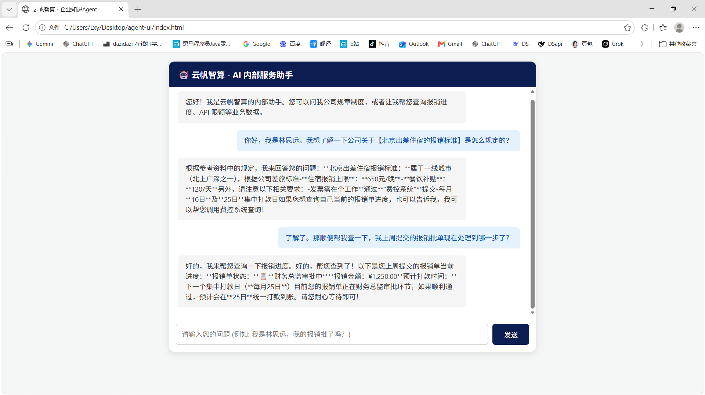
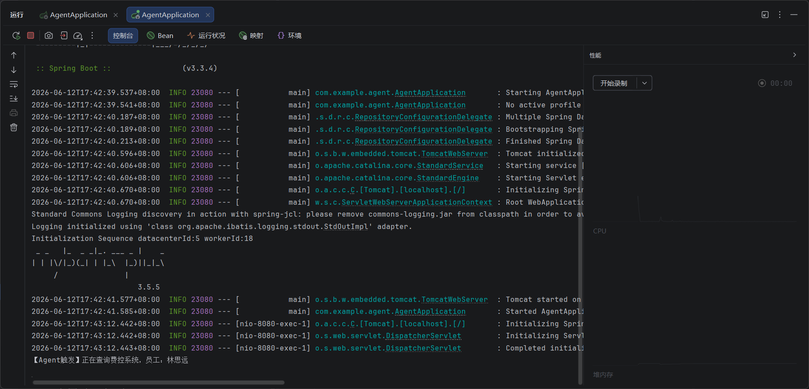

# Enterprise-AI-Agent (企业级静态知识检索与动态业务处理数字员工)

## 📌 项目简介
公司内部沉淀了大量规章制度（PDF/Word）与动态业务数据（MySQL），以往强依赖员工人工咨询 HR 或 DBA，沟通成本高且效率低下。

本项目基于 **Spring Boot 3** 与 **Spring AI** 框架，从 0 到 1 独立研发了一套 B 端智能 Agent（数字员工）系统。深度整合 **RAG**（检索增强生成）与 **Function Calling** 技术，彻底打通企业内外网数据壁垒，实现了从静态规章制度问答到动态业务查单的全链路端到端自动化闭环。

---

## 🎬 运行效果与架构
### 前端打字机交互效果


### 后端核心执行日志 (Function Calling 触发证据)


### 系统核心执行链路
```text
[用户提问] ──> [ChatController (Flux/SSE 响应)]
                    │
                    ▼
               [RagService] ──> 检索 [Redis Stack 向量库] 🔍 (获取静态上下文)
                    │
                    ▼
               [LlmService] ──> 调度 [DeepSeek / 智谱大模型]
                    │
              (判断是否需要工具)
                    ├─> YES ──> [Function Calling 拦截器] ──> 执行 [MyBatis-Plus] 查 MySQL 📦
                    └─> NO  ──> 直接生成流式文本
                    │
                    ▼
     [MessageChatMemoryAdvisor] ──> 自动追加/隔离 Session 记忆 🧠
                    │
                    ▼
 [前端打字机逐字输出 (首字延迟 < 500ms)] 🚀
🛠️ 技术栈 (Technical Skills)
后端基座： Java 17 / Spring Boot 3 / MyBatis-Plus

AI 编排： Spring AI / DeepSeek API (意图识别与工具回调) / 智谱 API (文本向量化)

数据与检索： Redis Stack (高维向量存储与余弦相似度检索) / MySQL (动态业务数据)

并发与流式： Project Reactor (Flux) / SSE (Server-Sent Events)

🌟 核心特性
构建 RAG 知识库底座： 针对大模型缺乏私有数据的问题，基于 Spring AI 搭建文档向量化流水线，接入 Redis Stack 实现语义检索。知识库支持零代码热更新，将内部规章问答准确率提升至 95% 以上，预计降低行政部门约 40% 的重复客服工作量。

落地 Agent 工具调用 (Function Calling)： 突破 RAG 仅能检索静态文档的局限，将底层 MyBatis-Plus 查库逻辑封装为 Agent Tool。大模型可自主提取参数并执行本地 Java 方法，实现 Text-to-SQL 级的自然语言查单，将人工查库耗时压缩至 2秒内。

响应式 SSE 流式推流： 针对长文本生成导致前端请求阻塞的痛点，采用 Reactor 响应式编程将接口重构为 Flux。基于 SSE 技术实现流式输出，将首字响应延迟 (TTFT) 降至 500ms 内，UI 响应速度提升超 80%。

多轮会话与上下文隔离： 引入 MessageChatMemoryAdvisor 结合动态 SessionID，实现高并发下的多用户上下文隔离。底层严格剥离“系统 RAG 提示词”与“用户对话历史”，赋予 Agent 多轮追问能力，减少用户约 50% 的重复输入，彻底解决 Token 消耗失控问题。

🚀 快速启动指南
1. 环境准备
Java: JDK 17

Database: MySQL 8.x, Redis Stack (需开启向量检索模块 Vector Search)

2. 本地配置脱敏
在 src/main/resources/application.yml 中配置你的本地环境与大模型密钥（推荐使用环境变量注入，保障 GitHub 安全）：

YAML
spring:
  datasource:
    url: jdbc:mysql://localhost:3360/你的数据库名?useSSL=false&serverTimezone=UTC
    username: root
    password: ${DB_PASSWORD:your-database-password}

  ai:
    openai:
      chat:
        options:
          model: deepseek-chat
          api-key: ${DEEPSEEK_KEY:your-deepseek-api-key-here}
          base-url: [https://api.deepseek.com/v1](https://api.deepseek.com/v1)
    
    vectorstore:
      redis:
        uri: redis://localhost:6379
        index: enterprise_knowledge_index
        prefix: "doc:"
3. 运行与测试
启动本地 MySQL 与 Redis Stack。

运行主启动类 AgentApplication.java。

使用项目配套前端 index.html 直接在浏览器中打开，即可开始体验丝滑的智能 Agent 服务！
